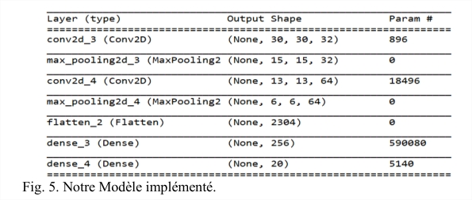

# Machine learning for recognizing emotions and styles from human movements
# Apprentissage automatique pour la reconnaissance d’émotions et de styles à partir de mouvements humains          
 
Résumé — Ce projet présente la mise en place d’algorithmes 
de Machines Learning et de Deep Learning afin de reconnaitre et 
identifier  les  personnes  qui  réalisent  des  actions  données.  On 
utilise notamment des réseaux de neurones convolutifs (CNN) et 
récursifs  (LSTM)  ainsi  qu’un  algorithme  basique  des  K  plus 
proches voisins (KNN).  
Keywords—  Reconnaissance  de  style/sujet  ;  KNN,  CNN, 
LSTM, Séries temporelles.

# I.  INTRODUCTION 
 
  La  vision  par  ordinateur  a  fait  d’énormes  progrès  et  les 
domaines  d’utilisation  ont  en  même  temps  augmentés.  On 
l’utilise  actuellement  dans  des  domaines  tels  que  la  vidéo-
surveillance,  la  reconnaissance  faciale  etc.  Ces  progrès  sont 
possibles sont rendus possibles grâce à des cameras tels que le 
Microsoft Kinect permettant de générer des squelettes en 3D en 
se  basant  sur  les  différentes  positions  des  articulations  du 
squelette, et cela en intégrant le point de vue. 
  C’est ce type de données numériques qui sont présentes dans 
nos trois bases de données d’étude, à savoir MSR Action 3D, 
Dance  Motion  Capture  Database  et  Emotional  Body  Motion 
Database qui contiennent des coordonnées de joints. 
  Outre  la  reconnaissance  d'action  qui  est  actuellement  très 
utilisés avec des algorithmes performants, la reconnaissance de 
style et de sujets dans des séquences de vidéos quant à elle n'a 
pas encore vraiment été analysé pourtant cela revêt d'une grande 
importance pour une reconnaissance plus approfondie.  
Cette reconnaissance plus approfondie passe par une analyse et 
une capacité plus approfondie sur l'analyse d'action étant donné 
que deux personnes n'ont pas la même gestuelle pour effectuer 
une action.  Et c’est justement ce sur quoi porte notre projet. 
 
# II.  OBJECTIFS 
L’objectif de ce projet est de pouvoir mettre en place des 
outils  de  Machine  Learning  (ML)  permettant  non  pas  de 
reconnaitre des actions mais plutôt reconnaitre les personnes qui 
effectuent ces actions.
On  parle  ici  donc  de  reconnaissance  de  style  car  chaque 
personne  possède  un  style  particulier  dans  l’exécution  de  ses 
mouvements.  
Et  donc  bien  que  les  mouvements  réalisés  par  les  deux 
personnes soient très proches et mêmes indiscernables pour un 
humain,  l’enjeu  est  donc  de  mettre  des  outils  informatiques 
permettant de le faire. 
### A.  Reconnaissance de style et d’émotions à partir d’un algorithme KNN (K Nearest Neighbors). 
L’idée  est  de  créer  un  algorithme  assez  basique  basé  sur 
KNN afin de pouvoir prédire les sujets réalisant ces actions. Le 
choix de cette méthode bien que n’étant pas la plus adaptée pour 
ce genre de problématique est utilisé dans tout le projet qu’afin 
de faire des analyses et des comparaisons entre ces algorithmes 
basiques  et  des  algorithmes  plus  évolués  tels  que  les 
Convolutional  Neural  Network  (CNN)  et  Long  Short-Term 
Memory (LSTM). Cet algorithme est ainsi donc appliqué sur les 
trois bases de données. 
 
### B.  Reconnaissance de style et d’émotions basés sur des algorithmes de Deep Learning. 
Après une première prédiction basée sur l’algorithme KNN, 
ce  qui  est  demandé  par  la  suite  c’est  la  construction 
d’architectures de  réseaux de  neurones  afin d’approfondir les 
analyses. 
 
# III.  REALISATION DU PROJET 
### A.  Prise en main des bases de données et gestion des données 

La  première  étape  de  ce  projet  est  la  récupération  des 
données sur internet et la constitution des différentes bases de 
données. Cette extraction de fichiers a été automatisée grâce à 
un script Javascript permettant de toutes les télécharger. Puis il 
a fallu nettoyer les données. 

      

Les fichiers dans les bases de données Emotional Body Motion 
(EBMDB)  et  Dance  Motion  Capture ont  pour  extension 
Biovision Hierarchy (BVH) organisé en arbre. Tandis que dans 
MSR Action 3D il s’agit de simple fichier txt.   

### B.  Mise en place de l’algorithme KNN. 
Dans notre projet, une action est représentée par une matrice 
de dimension (Nframes, Njoints, Ncoordonnées) car une action 
est  constituée  de  frames  chacune  d’elle  contenant  des 
articulations (Joint) et chaque articulation est composée d’un 
nombre  donné  de  coordonnées  (avec  Nframes=nombre  de 
frames, Njoints=nombre de d’articulations et Ncoordonnées= 
nombre décrivant chaque articulation). 
 
Cet  algorithme  prédit  la  classe  d’un  échantillon  en 
l’associant  à  la  classe  majoritaire  parmi  ses  K  plus  proches 
voisins nécessitant donc une distance. 
 
Le choix de la distance entre deux actions a été portée sur la 
Dynamic Time Warping (DTW) car toutes les actions n’ont pas 
la même taille.  
Il a fallu donc définir la distance entre deux frames. Pour 
cela on a utilisé la distance euclidienne. 
       

Le calcul de la DTW pouvant prendre beaucoup de temps, 
notamment comme c’est le cas ici avec des actions de grandes 
tailles.  On  a  ainsi  mis  en  place  un  paramètre 
Max_Warping permettant de limiter le nombre de calcul dans 
la  matrice  résultante  de  la  DTW  sans  pour  autant  avoir  un 
impact sur le résultat du calcul de la distance. 

       
### C.  Méthodes de Deep Learning 
#### 1)  CNN (CONVOLUTION NEURAL NETWORK) 
Afin d’améliorer si possible les résultats de l’algorithme KNN, 
notamment dans le cas des Bases de données Emotional Body 
Motion et Dance Motion Capture, il a été nécessaire de mettre 
en place un model convolutif prenant en entrée des images 
afin d’en faire des prédictions. 
 
##### a)  Encodage RGB des séquences. 

       
##### b)  Architecture du model CNN 
Les données d’entrée de notre modèle sont des images RGB 
que  l’on  a  ramené  à  une  taille  de  32 × 32   afin  que  les 
différences  de  taille  entre  les  séquences  ne  posent  pas  un 
problème pour la première couche de neurone de notre réseau de 
neurones. 
Nous avons utilisé plusieurs architectures différentes parmi 
lesquels DenseNeT afin d’évaluer nos données sur des modèles 
déjà  entrainés  mais  aussi  des  modèles  que  nous  avons  créés 
nous-même. 
     
Nous avons modifié ainsi le nombre de blocks dense(dense_block), la 
profondeur de chaque bloc, growth_rate(liaisons entre les couches d’un 
dense_bloc) et le nombre de filtres (filter) à appliquer pour faire corres-
pondre à chaque base de données. 
 
 
Notre modèle :  

     
Ces résultats nous montrent que la prédiction de sujet/style par ce model CNN 
est en soi assez complexe surtout quand les gestes réalisés ne demandent pas de 
grands mouvements, mais sont différenciable que par l’humeur.  
 
#### 2)  LSTM (Long short-term memory) 
Nous utilisons des réseaux de neurones LSTM car ils sont 
optimisés pour le travail sur les séries temporelles comme c’est 
le cas dans notre projet. Pour cela il a fallu mettre les données 
sous forme 3D (x, y, z) avec en x le nombre d'actions, en y le 
nombre  de  timesteps  pour  une  action  et  en  z  le  nombre  de 
paramètres. 
Afin de donner une taille fixe à toutes les séquences, on a 
réalisé  un  remplissage  (Padding)  sur  les  séquences  de  petite 
taille en rajoutant des 0 à la fin de chaque matrice afin qu’elles 
aient la même taille que la plus grande séquence. Bien entendu, 
cela ne cause pas de problèmes car nous avons  normalisé les 
valeurs entre [-1, 1].         
             
Le modèle LSTM choisi est composé de 3 couches LSTM 
suivies  par  deux  couches  Dense  (Fully  Connected)  dont  la 
dernière comprend un nombre de neurones égale au nombre de 
classes à prédire avec une activation Softmax. 
Nous n’avons pas pu lancer les entrainement sur les autres 
bases de données par manque de temps étant donné le temps 
demandé pour lancé un apprentissage complet. 
  
# IV.  PROBLEMES RENCONTRES 
 
Le  principal  problème  rencontré  a  été  le  temps 
d’entrainement  de  nos  modèles.  Lorsqu’on  devait  modifier 
certains  hyperparamètres.  Cela  pouvait  demander  des  temps 
d’entrainement et de validation assez grands. Car les machines 
sur lesquelles s’exécutent ces apprentissages ne sont pas assez 
performantes ou n’ont pas de bonne carte graphique afin de les 
lancer sur GPU. 
Il y avait également la recherche des bon hyperparamètres 
et d’architecture de nos réseaux de neurones. 
 
# V.  OPTIMISATIONS POUR LA SUITE 
Plusieurs optimisations restent toutefois envisageables dans 
le cadre de ce projet. 
Dans  la  représentation  des  séquences  de  squelette 
notamment, en utilisant des méthodes plus efficaces telles que le 
Skeleton Pose-Motion Feature (SPMF), mais aussi modifier les 
hyperparamètres voire même l’architecture afin d’améliorer ses 
prédictions, de même pour le modèle LSTM.  
 
# VI.  CONCLUSION  
 
Aujourd’hui  nos  algorithmes  KNN,  CNN  sont 
opérationnels  bien  que  toujours  optimisables.  L’algorithme 
LSTM fonctionne moyennement. Ce projet nous a permis de 
manipuler les séries temporelles mais aussi d’approfondir nos 
connaissances des algorithmes de Machine Learning ainsi que 
des bibliothèques tels que Keras, Tensorflow avec en parallèle 
la programmation en Python que nous avions utilisé pour notre 
projet de 2ième portant tout aussi sur le Machine Learning. 
       
##### Remerciements 
 
Nous souhaitons à remercier monsieur Maxime DEVANNE 
pour le temps ainsi que les précieux conseils qu’il nous a accordé 
tout  au  long  de  ce  projet.  Nous  le  remercions  aussi  pour  sa 
patience. 
##### REFERENCES 
 
[1].  Documentation sur la transformation SPMF : 
https://www.mdpi.com/1424-8220/19/8/1932/htm          
[2].  H. Pham, Louahdi Khoudour, Alain Crouzil, Pablo Zegers, Sergio 
A. Velastin, ‘’ Exploiting deep residual networks for human action 
recognition from skeletal data’’, pp 5-13 

